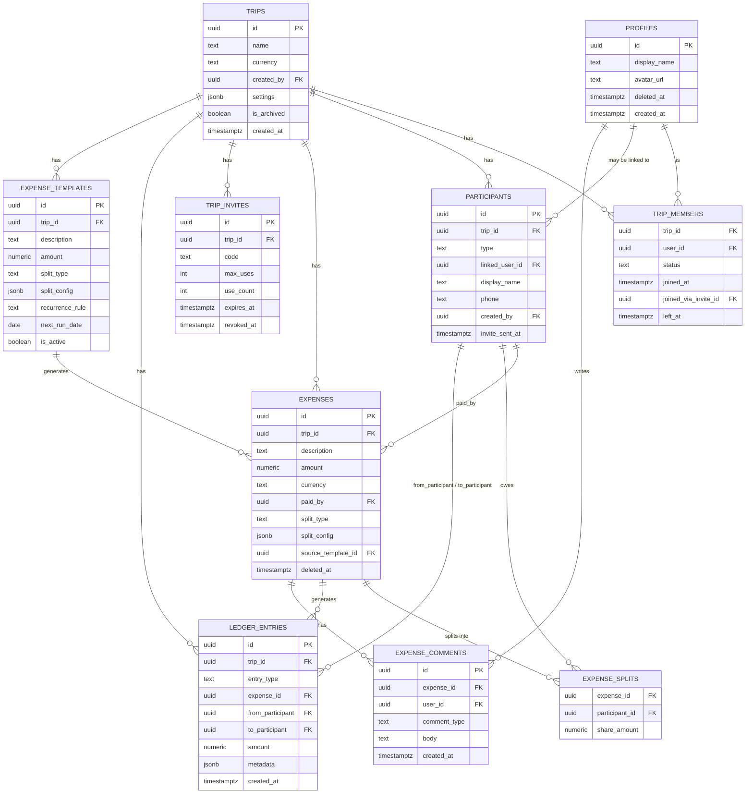

# Expensio — Data Model

Companion to `expensio-architecture.md`. One schema for both solo and collaborative trips —
see architecture doc §3 for why there's no separate "local" shape.

**One structural decision worth stating up front, since it's the key correction to the
manual-participant design:** `trip_members` and `participants` are two different things,
not one renamed table. `trip_members` answers "who has *access* to this trip" — it only
ever exists for people with a real, phone-verified `auth.uid()`, because that's what RLS
checks against. `participants` answers "who appears in the *financial ledger*" — every
active member has a matching participant row, but a participant doesn't need a matching
member row, because a manually-added placeholder has no account and nothing to authenticate.
Conflating the two would mean either giving placeholders fake access rows they can never use,
or teaching every RLS policy to understand "invited but not real yet" — both worse than
keeping the two concerns separate.

## Entity relationship diagram



## Design principles behind this schema

1. **No denormalized member arrays.** `trip_members` is the one place *access* lives.
   Nothing else caches a list of who's in a trip.
2. **Access and financial identity are separate tables, on purpose.** See the note at the
   top of this doc — `trip_members` (access) vs `participants` (ledger attribution).
3. **Nothing about money is ever `UPDATE`d.** `ledger_entries` is insert-only. `expenses`
   can be edited (it's a record of "what is this expense currently"), but every edit also
   writes a `ledger_entries` row, so the history of what changed is never lost even though
   the current-state row is mutable.
4. **`jsonb` is used deliberately, not everywhere.** `trips.settings` and
   `expenses.split_config` are the two places the schema needs to flex without a migration.
   Everything load-bearing for permissions or money (`status`, `type`, `amount`, foreign
   keys) is a real typed column.
5. **The client never computes its own splits.** `expense_splits` rows are generated
   server-side, inside the `add_expense`/`edit_expense` RPCs, from `split_type` +
   `split_config` — never as a client-supplied array. The client sends intent; Postgres is
   the only thing that turns that into per-person numbers.
6. **A placeholder's display name is theirs; a registered member's isn't, really.**
   `participants.display_name` is authoritative for `type = 'placeholder'` (there's no
   profile to draw from). For `type = 'registered'`, treat `profiles.display_name` (via
   `linked_user_id`) as the source of truth — `participants.display_name` is just a
   creation-time snapshot. This is also why account deletion (further down) needs no special
   handling for participants: once a profile is pseudonymized, every registered participant
   row reflects that automatically through the join.

## DDL

```sql
-- Extends auth.users with app-facing profile data.
create table profiles (
  id uuid primary key references auth.users(id) on delete cascade,
  display_name text,
  avatar_url text,
  deleted_at timestamptz,              -- set by delete_account(); id and history are kept
  created_at timestamptz not null default now()
);

create table trips (
  id uuid primary key default gen_random_uuid(),
  name text not null,
  currency text not null default 'INR',
  created_by uuid not null references profiles(id),
  settings jsonb not null default '{}'::jsonb,  -- includes budget_per_person, start_date, end_date
  is_archived boolean not null default false,
  created_at timestamptz not null default now(),
  updated_at timestamptz not null default now()
);

-- ACCESS ONLY. Answers "can this auth.uid() read/write this trip" — nothing else. No role
-- column: every active member has identical permissions (see permissions doc, "almost
-- nobody has destructive power over other people"). The only ways a row here changes after
-- creation are join_trip_via_code and leave_trip — never a forced removal.
-- joined_via_invite_id enables one narrow exception: an inviter undoing their own recent
-- mistake — see revoke_recent_join in the permissions doc.
create table trip_members (
  trip_id uuid not null references trips(id) on delete cascade,
  user_id uuid not null references profiles(id),
  status text not null default 'active' check (status in ('active', 'left')),
  joined_at timestamptz not null default now(),
  joined_via_invite_id uuid references trip_invites(id),
  left_at timestamptz,
  primary key (trip_id, user_id)
);

-- FINANCIAL IDENTITY ONLY. Answers "who can be paid_by / owe a split / appear in the
-- ledger" for this specific trip. A 'registered' row always has a matching trip_members row
-- for the same (trip_id, linked_user_id) — created alongside it in create_trip and
-- join_trip_via_code. A 'placeholder' row never does, and never needs to: they have no
-- auth.uid(), so any active trip member manages their expenses on their behalf (permissions
-- doc §2 pattern — "any active member", not a new tier).
create table participants (
  id uuid primary key default gen_random_uuid(),
  trip_id uuid not null references trips(id) on delete cascade,
  type text not null check (type in ('registered', 'placeholder')),
  linked_user_id uuid references profiles(id),
  display_name text not null,
  phone text,                          -- required to add a placeholder invite target; optional otherwise
  created_by uuid not null references profiles(id),
  invite_sent_at timestamptz,          -- null until an SMS/email invite actually goes out
  created_at timestamptz not null default now(),
  constraint registered_needs_user check (type = 'placeholder' or linked_user_id is not null)
);
-- One participant row per real person per trip — prevents a registered member somehow
-- getting two ledger identities in the same trip.
create unique index on participants(trip_id, linked_user_id) where linked_user_id is not null;

-- Codes are NOT declared unique at the DB level — see generate_invite in the permissions
-- doc for why a hard UNIQUE(code) doesn't hold up at 6 digits, and how uniqueness among
-- currently-valid codes is enforced instead.
create table trip_invites (
  id uuid primary key default gen_random_uuid(),
  trip_id uuid not null references trips(id) on delete cascade,
  code text not null,
  created_by uuid not null references profiles(id),
  max_uses int,
  use_count int not null default 0,
  expires_at timestamptz,
  revoked_at timestamptz,
  created_at timestamptz not null default now()
);

-- Recurring-expense definitions. A scheduled job turns due templates into real
-- expenses via the same add_expense RPC everything else uses — no separate write path.
create table expense_templates (
  id uuid primary key default gen_random_uuid(),
  trip_id uuid not null references trips(id) on delete cascade,
  description text not null,
  amount numeric(12,2) not null check (amount > 0),
  currency text not null,
  paid_by uuid not null references participants(id),
  category text,
  split_type text not null default 'equal',
  split_config jsonb not null default '{}'::jsonb,
  recurrence_rule text not null check (recurrence_rule in ('weekly', 'monthly', 'yearly')),
  next_run_date date not null,
  is_active boolean not null default true,
  created_by uuid not null references profiles(id),
  created_at timestamptz not null default now()
);

create table expenses (
  id uuid primary key default gen_random_uuid(),
  trip_id uuid not null references trips(id) on delete cascade,
  description text not null,
  amount numeric(12,2) not null check (amount > 0),
  currency text not null,             -- per-expense, not inherited — a trip can mix currencies
  paid_by uuid not null references participants(id),
  category text,
  expense_date date not null default current_date,
  receipt_path text,                  -- Supabase Storage path
  split_type text not null default 'equal'
    check (split_type in ('equal', 'exact', 'percentage', 'shares', 'adjustment', 'itemized', 'reimbursement')),
  split_config jsonb not null default '{}'::jsonb,
  source_template_id uuid references expense_templates(id),
  created_by uuid not null references profiles(id),   -- always a real user — someone had to tap the button
  created_at timestamptz not null default now(),
  updated_at timestamptz not null default now(),
  deleted_at timestamptz
);

-- Server-computed, one row per participant's share of an expense.
create table expense_splits (
  expense_id uuid not null references expenses(id) on delete cascade,
  participant_id uuid not null references participants(id),
  share_amount numeric(12,2) not null,
  primary key (expense_id, participant_id)
);

-- User discussion AND the system-generated edit trail, in one feed. user_id stays on
-- profiles, not participants — only a real logged-in person can write a comment; a
-- placeholder has nothing to type with.
create table expense_comments (
  id uuid primary key default gen_random_uuid(),
  expense_id uuid not null references expenses(id) on delete cascade,
  user_id uuid not null references profiles(id),
  comment_type text not null default 'user' check (comment_type in ('user', 'system')),
  body text not null,
  created_at timestamptz not null default now()
);

-- Append-only. Nothing in this table is ever UPDATEd.
create table ledger_entries (
  id uuid primary key default gen_random_uuid(),
  trip_id uuid not null references trips(id) on delete cascade,
  entry_type text not null check (entry_type in (
    'expense_added', 'expense_edited', 'expense_deleted',
    'payment_recorded', 'payment_confirmed', 'payment_disputed'
  )),
  expense_id uuid references expenses(id),
  from_participant uuid references participants(id),   -- who owes / who paid
  to_participant uuid references participants(id),     -- who is owed / who received
  amount numeric(12,2) not null,
  currency text not null,
  created_by uuid not null references profiles(id),    -- always a real user
  metadata jsonb not null default '{}'::jsonb,
  created_at timestamptz not null default now()
);

-- Derived, never written to directly. One row per (trip, participant, currency).
create view trip_balances as
select trip_id, from_participant as participant_id, currency, -sum(amount) as balance_delta
from ledger_entries where from_participant is not null
group by trip_id, from_participant, currency
union all
select trip_id, to_participant as participant_id, currency, sum(amount) as balance_delta
from ledger_entries where to_participant is not null
group by trip_id, to_participant, currency;

-- Indexes
create index on trip_members(user_id);
create index on participants(trip_id);
create index on expenses(trip_id);
create index on expense_comments(expense_id);
create index on ledger_entries(trip_id, created_at);
create index on expense_templates(next_run_date) where is_active;
```

## `split_config` shapes, one per `split_type`

Unchanged in shape from before — the values inside are now **`participant_id`s**, not
`user_id`s, since `expense_splits`/`ledger_entries` point at `participants` now.

| `split_type` | `split_config` shape | Who it's for |
|---|---|---|
| `equal` | `{}` (all active participants, equal shares) | default |
| `exact` | `{"shares": {"pid1": 500, "pid2": 300}}` | "I know exactly what each person owes" |
| `percentage` | `{"shares": {"pid1": 60, "pid2": 40}}` | must sum to 100, validated in the RPC |
| `shares` | `{"units": {"pid1": 2, "pid2": 1}}` | proportional, e.g. couple = 2 units, solo = 1 |
| `adjustment` | `{"adjustments": {"pid1": 200}, "remainder": "equal"}` | one person gets a fixed extra/less, rest splits the remainder equally |
| `itemized` | `{"items": [{"label": "Pizza", "amount": 450, "shared_by": ["pid1","pid2"]}], "tax": 40, "tip": 60, "tax_tip_split": "proportional"}` | line-item receipt splitting |
| `reimbursement` | `{"reimburse_to": "pid1", "shares": {"pid2": 500, "pid3": 500}}` | inverse of a normal expense |

## Worked example: what "elastic" buys you

Say six months in you want **percentage-based splits with a "who's exempt" list** —
something you didn't design for on day one. With this schema that's a `split_config` shape
change, handled entirely inside the `add_expense`/`edit_expense` RPC that interprets it — no
new column, no migration, no client/server schema mismatch to manage.

## Account deletion & data rights

The Splitwise research flags GDPR/CCPA-style deletion rights as a real requirement, and
there's a genuine tension to resolve: **you can't hard-delete a user who still has shared
financial history with other people.**

The resolution: deletion **pseudonymizes, it doesn't cascade-delete.**

- `profiles.id` is never removed while any `participants` row still references it via
  `linked_user_id` — that FK integrity is what keeps everyone else's balances correct.
- `delete_account` scrubs `profiles.display_name` → `"Deleted user"`, clears `avatar_url`,
  and strips the identity's email/phone/OAuth links via Supabase Auth's admin API — without
  touching the `auth.users` row itself.
- Because every `participants` row for a registered user resolves its display name through
  `profiles` (Design Principle 6), nothing about `participants` or the ledger needs to
  change at deletion time — the "Deleted user" label just appears everywhere automatically.
- Same behavior for someone who simply *leaves* a trip — their historical expenses and
  ledger entries stay, only `trip_members.status = 'left'` changes, access is cut, nothing
  is deleted.
