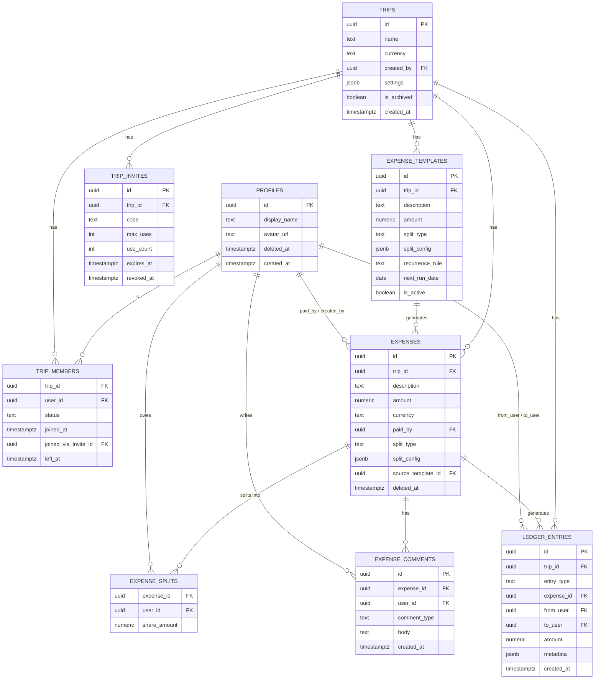

# Expensio — Data Model

Companion to `expensio-architecture.md`. One schema for both solo and collaborative trips —
see architecture doc §3 for why there's no separate "local" shape.

## Entity relationship diagram



## Design principles behind this schema

1. **No denormalized member arrays.** `trip_members` is the one place membership lives.
   Nothing else caches a list of who's in a trip.
2. **Nothing about money is ever `UPDATE`d.** `ledger_entries` is insert-only. `expenses`
   can be edited (it's a record of "what is this expense currently"), but every edit also
   writes a `ledger_entries` row, so the history of what changed is never lost even though
   the current-state row is mutable.
3. **`jsonb` is used deliberately, not everywhere.** `trips.settings` and
   `expenses.split_config` are the two places the schema needs to flex without a migration
   (custom split configurations, per-trip preferences, future expense metadata). Everything
   load-bearing for permissions or money (`status`, `amount`, foreign keys) is a real
   typed column — flexibility where you'll actually extend things, rigidity where
   correctness matters.
4. **The client never computes its own splits.** `expense_splits` rows are generated
   server-side, inside the `add_expense`/`edit_expense` RPCs, from `split_type` +
   `split_config`. The client sends intent ("split equally," "split 60/40"); Postgres is the
   only thing that turns that into per-person numbers.

## DDL

```sql
-- Extends auth.users with app-facing profile data.
create table profiles (
  id uuid primary key references auth.users(id) on delete cascade,
  display_name text,
  avatar_url text,
  deleted_at timestamptz,              -- set by delete_account(); id and history are kept
  created_at timestamptz not null default now()
);

create table trips (
  id uuid primary key default gen_random_uuid(),
  name text not null,
  currency text not null default 'INR',
  created_by uuid not null references profiles(id),
  settings jsonb not null default '{}'::jsonb,
  is_archived boolean not null default false,
  created_at timestamptz not null default now(),
  updated_at timestamptz not null default now()
);

-- The single source of truth for "who can access this trip."
-- The single source of truth for "who can access this trip." No role column: every
-- active member has identical permissions (see permissions doc, "almost nobody has
-- destructive power over other people"). The only ways a row here changes after
-- creation are join_trip_via_code and leave_trip — never a forced removal.
-- joined_via_invite_id enables one narrow exception: an inviter undoing their own
-- recent mistake — see revoke_recent_join in the permissions doc.
create table trip_members (
  trip_id uuid not null references trips(id) on delete cascade,
  user_id uuid not null references profiles(id),
  status text not null default 'active' check (status in ('active', 'left')),
  joined_at timestamptz not null default now(),
  joined_via_invite_id uuid references trip_invites(id),
  left_at timestamptz,
  primary key (trip_id, user_id)
);

create table trip_invites (
  id uuid primary key default gen_random_uuid(),
  trip_id uuid not null references trips(id) on delete cascade,
  code text not null unique,
  created_by uuid not null references profiles(id),
  max_uses int,                       -- null = unlimited until expiry
  use_count int not null default 0,
  expires_at timestamptz,
  revoked_at timestamptz,
  created_at timestamptz not null default now()
);

-- Recurring-expense definitions. A scheduled job turns due templates into real
-- expenses via the same add_expense RPC everything else uses — no separate write path.
create table expense_templates (
  id uuid primary key default gen_random_uuid(),
  trip_id uuid not null references trips(id) on delete cascade,
  description text not null,
  amount numeric(12,2) not null check (amount > 0),
  currency text not null,
  paid_by uuid not null references profiles(id),
  category text,
  split_type text not null default 'equal',
  split_config jsonb not null default '{}'::jsonb,
  recurrence_rule text not null check (recurrence_rule in ('weekly', 'monthly', 'yearly')),
  next_run_date date not null,
  is_active boolean not null default true,
  created_by uuid not null references profiles(id),
  created_at timestamptz not null default now()
);

create table expenses (
  id uuid primary key default gen_random_uuid(),
  trip_id uuid not null references trips(id) on delete cascade,
  description text not null,
  amount numeric(12,2) not null check (amount > 0),
  currency text not null,             -- per-expense, not inherited — a trip can mix currencies
  paid_by uuid not null references profiles(id),
  category text,
  expense_date date not null default current_date,
  receipt_path text,                  -- Supabase Storage path
  split_type text not null default 'equal'
    check (split_type in ('equal', 'exact', 'percentage', 'shares', 'adjustment', 'itemized', 'reimbursement')),
  split_config jsonb not null default '{}'::jsonb,
  source_template_id uuid references expense_templates(id),  -- set when generated from a recurring template
  created_by uuid not null references profiles(id),
  created_at timestamptz not null default now(),
  updated_at timestamptz not null default now(),
  deleted_at timestamptz              -- soft delete only; ledger history references these rows
);

-- Server-computed, one row per member's share of an expense.
create table expense_splits (
  expense_id uuid not null references expenses(id) on delete cascade,
  user_id uuid not null references profiles(id),
  share_amount numeric(12,2) not null,
  primary key (expense_id, user_id)
);

-- User discussion AND the system-generated edit trail ("Alice changed the amount to
-- ₹500") in one feed, ordered by created_at. Distinct from ledger_entries: comments are
-- conversational, not financial — deleting a comment never has to touch a balance.
create table expense_comments (
  id uuid primary key default gen_random_uuid(),
  expense_id uuid not null references expenses(id) on delete cascade,
  user_id uuid not null references profiles(id),
  comment_type text not null default 'user' check (comment_type in ('user', 'system')),
  body text not null,
  created_at timestamptz not null default now()
);

-- Append-only. Nothing in this table is ever UPDATEd.
create table ledger_entries (
  id uuid primary key default gen_random_uuid(),
  trip_id uuid not null references trips(id) on delete cascade,
  entry_type text not null check (entry_type in (
    'expense_added', 'expense_edited', 'expense_deleted',
    'payment_recorded', 'payment_confirmed', 'payment_disputed'
  )),
  expense_id uuid references expenses(id),
  from_user uuid references profiles(id),   -- who owes / who paid
  to_user uuid references profiles(id),     -- who is owed / who received
  amount numeric(12,2) not null,
  currency text not null,             -- balances are tracked per currency, never auto-merged
  created_by uuid not null references profiles(id),
  metadata jsonb not null default '{}'::jsonb,
  created_at timestamptz not null default now()
);

-- Derived, never written to directly. One row per (trip, user, currency) — mirrors
-- Splitwise's "you owe $12 and ₹800" behavior: separate currencies are never silently
-- merged. A single converted total is a display-layer computation (see architecture
-- doc §9), not something this view or any stored column does.
create view trip_balances as
select
  trip_id,
  from_user as user_id,
  currency,
  -sum(amount) as balance_delta
from ledger_entries
where from_user is not null
group by trip_id, from_user, currency
union all
select
  trip_id,
  to_user as user_id,
  currency,
  sum(amount) as balance_delta
from ledger_entries
where to_user is not null
group by trip_id, to_user, currency;

-- Indexes
create index on trip_members(user_id);
create index on expenses(trip_id);
create index on expense_comments(expense_id);
create index on ledger_entries(trip_id, created_at);
create index on expense_templates(next_run_date) where is_active;
create unique index on trip_invites(code);
```

## `split_config` shapes, one per `split_type`

All seven interpreted server-side, inside `add_expense`/`edit_expense` — the client only
ever sends intent, never a computed per-person amount (see Design Principle 4).

| `split_type` | `split_config` shape | Who it's for |
|---|---|---|
| `equal` | `{}` (all active members, equal shares) | default |
| `exact` | `{"shares": {"uid1": 500, "uid2": 300}}` | "I know exactly what each person owes" |
| `percentage` | `{"shares": {"uid1": 60, "uid2": 40}}` | must sum to 100, validated in the RPC |
| `shares` | `{"units": {"uid1": 2, "uid2": 1}}` | proportional, e.g. couple = 2 units, solo = 1 |
| `adjustment` | `{"adjustments": {"uid1": 200}, "remainder": "equal"}` | one person gets a fixed extra/less, rest splits the remainder equally |
| `itemized` | `{"items": [{"label": "Pizza", "amount": 450, "shared_by": ["uid1","uid2"]}], "tax": 40, "tip": 60, "tax_tip_split": "proportional"}` | line-item receipt splitting — this is exactly the shape the FastAPI OCR endpoint (architecture doc §6) should return as a draft |
| `reimbursement` | `{"reimburse_to": "uid1", "shares": {"uid2": 500, "uid3": 500}}` | inverse of a normal expense — others owe the payer back, not vice versa |

## Worked example: what "elastic" buys you

Say six months in you want **percentage-based splits with a "who's exempt" list** — something
you didn't design for on day one. With this schema that's a `split_config` shape change
(`{"type": "percentage", "shares": {...}, "exempt": [...]}`), handled entirely inside the
`add_expense`/`edit_expense` RPC that interprets `split_config` — no new column, no
migration, no client/server schema mismatch to manage. Compare that to needing a new
Firestore document shape and a new security-rule branch for it, which is what a change like
this would have cost in TripSpend.

## Account deletion & data rights

The Splitwise research flags GDPR/CCPA-style deletion rights as a real requirement, and
there's a genuine tension to resolve, not just a checkbox: **you can't hard-delete a user
who still has shared financial history with other people** — three other trip members'
balances legitimately depend on ledger rows that reference that user's ID.

The resolution: deletion **pseudonymizes, it doesn't cascade-delete.**

- `profiles.id` is never removed while any `ledger_entries`/`expense_splits` row still
  references it — that FK integrity is what keeps everyone else's balances correct.
- A `delete_account` RPC instead: scrubs `profiles.display_name` → `"Deleted user"`,
  clears `avatar_url`, and calls Supabase Auth's admin API to strip the identity's email/
  phone/OAuth links (so the person can no longer log in and their PII is gone from
  `auth.users`) — without deleting the `auth.users` row itself, since that's what
  `profiles.id` depends on.
- Add `profiles.deleted_at`, checked by the UI to render "Deleted user" instead of a name,
  but the ledger stays intact and correct for everyone still in a trip with them.
- This is also exactly the right behavior for someone who *leaves* a trip, independent of
  deletion — their historical expenses and ledger entries stay, only their ongoing access
  is cut (matches the `trip_members.status = 'left'` design already in place).
