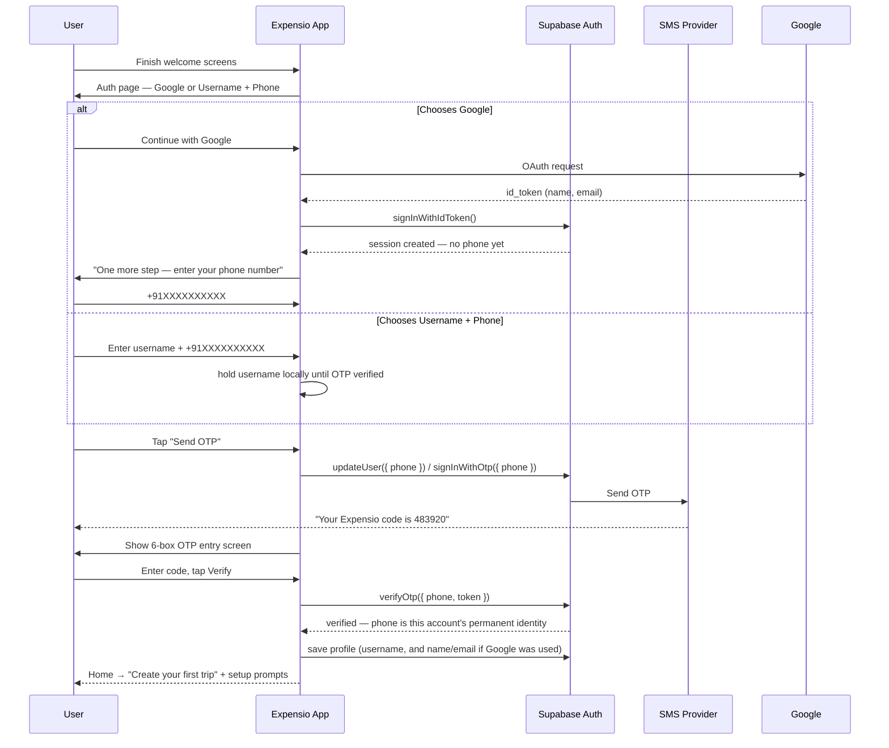

# Expensio — Onboarding & Authentication

Companion to `expensio-architecture.md` §3. Every user completes sign-up and mandatory
phone verification before reaching the app — no anonymous/guest mode. This document is the
full flow, screen by screen, plus the production concerns (rate limiting, India SMS
compliance, identity conflicts) that a "just wire up Supabase Auth" pass tends to skip.

## 1. The core design decision

**Every account converges on one universal, verified credential: a phone number.**
Google sign-in is a faster way to prefill a name — it is never a substitute for phone
verification. This is simpler than a multi-method "email or phone or OAuth" recovery model:
there is exactly one canonical identity per user, always phone-based, and everything else
(username, Google-linked name/email) sits on top of it as profile data, not as an
alternative login path competing with it.

## 2. Screen-by-screen flow

1. **Welcome / onboarding carousel** — a few intro screens on what Expensio does. No auth yet.
2. **Auth page** — two buttons: **Continue with Google** or **Continue with phone number**.
3. **Branch:**
   - *Google chosen:* standard OAuth consent, returns name + email. Next screen: **"One
     more step — enter your phone number"** with a "Send OTP" button below the field.
   - *Phone chosen:* one form, two fields — **Username** and **Phone number** — with a
     "Send OTP" button below.
4. **OTP entry screen** — six single-digit boxes centered on screen, auto-advancing between
   them, with a **Verify** button below. A "Resend code" link appears once the cooldown
   (§3) expires.
5. **On successful verify → Home**, with:
   - A **"Create your first trip"** primary call-to-action, front and center.
   - A short, skippable setup section — see §5 for what goes here.

## 3. Phone OTP — rate limiting, abuse, and India-specific compliance

Carried over unchanged from the earlier design, since none of this depended on whether
phone verification was optional or mandatory:

- One OTP request per 60 seconds per number (Supabase default) — show a visible countdown
  on the resend button rather than loosening this.
- CAPTCHA (hCaptcha/Turnstile) in front of the *send* call, not just verify — without it,
  the send endpoint is directly exploitable for SMS-pumping fraud (bots requesting OTPs to
  premium-rate numbers to drain your SMS budget). Now that phone verification is mandatory
  for every signup, this endpoint gets hit by every single install, which raises the stakes
  on getting this right before launch, not after.
- Cap verify attempts per code (~5) before requiring a fresh send.
- Twilio for development; move to MSG91 (or similar) via Supabase's Send SMS Hook before
  real India volume — Twilio is noticeably pricier per SMS here.
- **India's TRAI DLT regulations require sender ID + message template pre-registration**
  before OTPs will deliver to Indian numbers at all. Unregistered messages are dropped
  silently, not bounced. Register this before it's the reason nobody can sign up.

## 4. Identity conflicts

If someone enters a phone number already tied to a different account (own phone reused, or
someone else's), Supabase returns "identity already in use" rather than merging anything.
Surface it as its own screen state, not a generic error: **"This number is already
registered — sign in with it instead?"** → drops into the phone-OTP sign-in path for that
existing account. No automatic merging of two account histories — that's a real feature
with real edge cases (duplicate trips, conflicting balances) that doesn't belong inside the
auth flow.

## 5. First-run Home: what to ask for, and in what order

You asked for suggestions here — ranked by how much they actually belong on this screen
versus asked for later, contextually:

**Belongs on this screen, skippable:**
- **Default currency** — auto-detect from device locale/SIM region (India → INR), shown as
  a pre-filled but editable dropdown, not a blank field to fill in.
- **App lock setup** (§6) — a natural moment to offer, right after identity verification,
  especially for a money app. One toggle: "Secure Expensio with Face ID / fingerprint."

**Deliberately NOT on this screen — ask contextually instead:**
- **Push notification permission** — requesting this cold, before the person has any reason
  to want a notification, is exactly when opt-in rates are lowest. Ask when it's earned:
  right after they create their first trip ("get notified when someone adds an expense") or
  right after they generate their first invite. Same permission, much better acceptance
  rate asked in context.
- **Contacts permission** — optional, and only worth asking when they go to invite someone,
  framed as "see which of your contacts are already on Expensio." Worth calling out as a
  feature idea in its own right: since every account now has a verified phone number, a
  contacts-based "friends already here" lookup becomes possible in a way it wasn't when
  phone was optional — flagging this as a nice v1.1 candidate, not something to build into
  the auth flow itself.
- **Profile photo, language** — fully optional, available in Settings, not part of onboarding.

## 6. App lock (biometric / PIN)

A separate, client-side security layer on top of the Supabase session — not a re-login.

- **What it gates:** the app's UI on open/resume, not the backend session. The Supabase
  session stays valid in the background; app lock just blocks the screen until the device's
  biometrics or a local PIN clears it.
- **Trigger:** on app foreground after being backgrounded past a grace period (default
  ~30–60 seconds) — not on every single app-switch, which trains people to find it
  annoying and turn it off. Make the grace period configurable in Settings.
- **Mechanism:** a Capacitor biometric plugin wrapping iOS LocalAuthentication / Android
  BiometricPrompt for Face ID / fingerprint, with PIN as the fallback when biometrics are
  unavailable or fail.
- **Storage:** the "app lock enabled" flag and the PIN (as a salted hash, never plaintext)
  go in secure device storage (Keychain/Keystore via a Capacitor secure-storage plugin) —
  the same tier as the refresh token, not the general-purpose Preferences store.
- **Forgot PIN, not a dead end:** since this only gates the UI, not the account, "forgot
  PIN" offers "sign out and verify your phone number again" as an escape hatch — re-running
  the OTP flow re-establishes identity and resets the app lock, rather than locking someone
  out of their own account.
- **Default:** off, offered as a toggle both during first-run setup (§5) and anytime after
  in Settings → Security.

## 7. Sessions & devices

- Supabase issues a short-lived JWT access token plus a longer-lived refresh token, stored
  via Capacitor's secure storage — never `localStorage`.
- Because every account is phone-verified from the start, multi-device sign-in works
  uniformly for everyone: sign in with the same phone number (or Google account) on a new
  device, verify OTP, and PowerSync pulls every trip tied to that `user_id`. There's no
  "anonymous accounts can't do this" caveat to design around anymore.

## 8. Security & compliance

- **OTP is identity verification, not 2FA** — requested once at signup or when signing into
  a new device, never as a recurring mid-session second factor. Keep the UI copy consistent
  with that ("verify your number," not "enter your security code").
- **Phone numbers are never shown to other trip members** — used only for verification,
  recovery, and (if you build it) the contacts-lookup feature above, always opt-in.
- **No accounts for under-13s** — an age acknowledgment checkbox at signup is enough for v1.
- **Account deletion** strips the phone/Google identity via the Auth admin API — see
  `expensio-data-model.md`, "Account deletion & data rights," for the full pseudonymization
  design; this doc is the front half of that same flow.

## 9. Still open

- **Apple Sign-In:** only becomes an App Store requirement the moment Google OAuth ships on
  iOS — Apple requires offering it as an equivalent option whenever another third-party
  login is present. Worth deciding before iOS submission, not after.
- **Is "username" a unique, searchable handle, or just a display name?** I've assumed the
  latter (no uniqueness constraint, purely a name shown to other members) since nothing in
  the app needs to look someone up by username — people connect via invite code or phone.
  Flag if you actually want unique handles; it changes the signup validation and adds a
  "username taken" error state.
- **App lock: opt-in or forced?** I've designed it as an off-by-default, prominently
  offered toggle. If you want it mandatory for a money app, that's a one-line change to
  §6's default, not a redesign.
