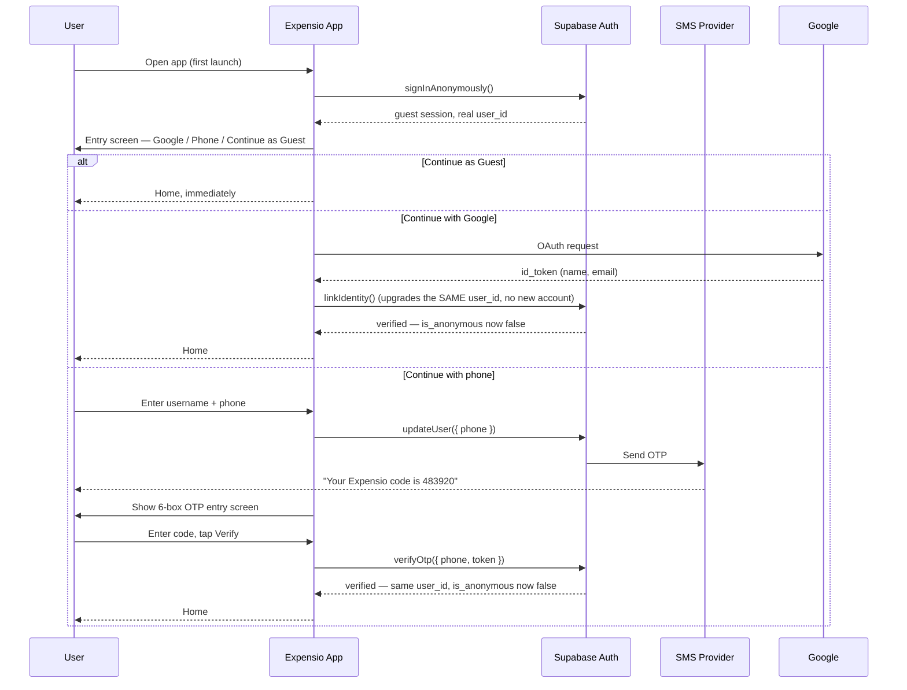
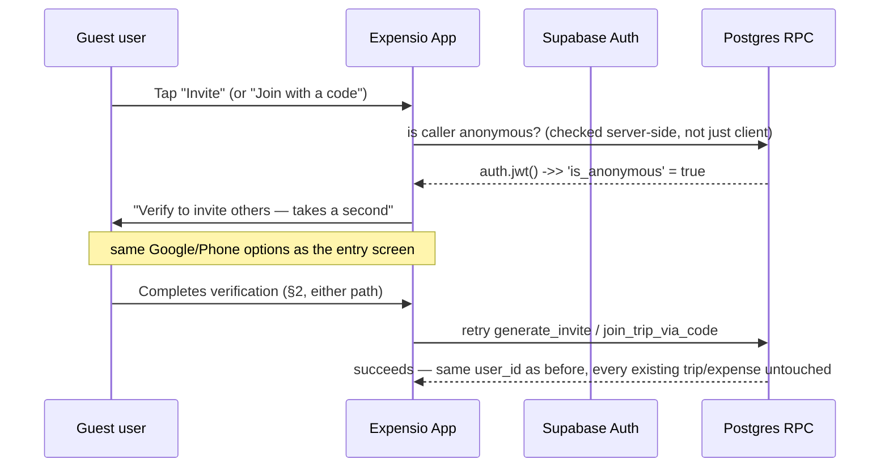

# Expensio — Onboarding & Authentication

Companion to `expensio-architecture.md` §3. Every user gets a working account the instant
the app opens — **guest by default, no forced screens.** Verification (phone or Google) is
required at exactly one moment: trying to collaborate with someone else. This document is
the full flow, screen by screen, plus the production concerns (rate limiting, India SMS
compliance, identity conflicts) a "just wire up Supabase Auth" pass tends to skip.

## 1. The core design decision

**Guests get the entire solo experience for free — creating trips, adding expenses,
managing placeholder participants, everything except reaching another real account.**
The moment they try to generate an invite or join one via a code, that's the one gate:
verify first, then continue. Verification means "not anonymous" — Google sign-in alone
clears it, same as phone. There's no forced "one more step, give us your phone number too"
after Google anymore; that only made sense when verification was mandatory for everyone.
Phone stays the natural default for people who don't want to use Google, and it's still
what powers the participant-claiming mechanism (permissions doc §4) when it's on file — but
it's a means, not the only accepted proof of "not anonymous."

## 2. Screen-by-screen flow

1. **Welcome / onboarding carousel** — a few intro screens on what Expensio does.
2. **Entry screen** — three options, no hierarchy implied by order:
   **Continue with Google** / **Continue with phone number** / **Continue as Guest.**
3. **Branch:**
   - *Guest:* nothing else — straight to Home on a fresh anonymous session.
   - *Google:* standard OAuth consent (name + email) → straight to Home. No forced phone step.
   - *Phone:* one form, two fields — **Username** and **Phone number** — "Send OTP" below.
4. **(Phone path only) OTP entry screen** — six single-digit boxes, auto-advancing, **Verify**
   button below, "Resend code" once the cooldown (§3) expires.
5. **Home**, for everyone regardless of path: **"Create your first trip"** front and center,
   plus a short skippable setup section (§5).

## 3. The collaborative gate — how a guest actually hits it

The RPC-level check (permissions doc §4) is the real enforcement — the client prompt is
just good UX, never trusted alone, consistent with every other rule in this design.

## 4. Phone OTP — rate limiting, abuse, and India-specific compliance

Applies whenever phone verification happens, whether that's the initial signup path or a
guest clearing the collaborative gate later:

- One OTP request per 60 seconds per number (Supabase default) — show a visible countdown
  on the resend button rather than loosening this.
- CAPTCHA (hCaptcha/Turnstile) in front of the *send* call, not just verify — without it,
  the send endpoint is directly exploitable for SMS-pumping fraud (bots requesting OTPs to
  premium-rate numbers to drain your SMS budget).
- Cap verify attempts per code (~5) before requiring a fresh send.
- Twilio for development; move to MSG91 (or similar) via Supabase's Send SMS Hook before
  real India volume — Twilio is noticeably pricier per SMS here.
- **India's TRAI DLT regulations require sender ID + message template pre-registration**
  before OTPs will deliver to Indian numbers at all. Unregistered messages are dropped
  silently, not bounced. Register this before it's the reason nobody can verify.

## 5. Identity conflicts

If someone enters a phone number already tied to a different account, Supabase returns
"identity already in use" rather than merging anything. Surface it as its own screen state:
**"This number is already registered — sign in with it instead?"** → drops into the
phone-OTP sign-in path for that existing account. No automatic merging of two account
histories — a guest's solo trips and an existing verified account's trips staying separate
is the correct, safe default, not a gap.

## 6. First-run Home: what to ask for, and in what order

Same for every entry path — guest or verified:

**Belongs on this screen, skippable:**
- **Default currency** — auto-detect from device locale/SIM region (India → INR), editable.
- **App lock setup** (§7) — natural moment to offer, especially for a money app.

**Deliberately NOT on this screen — ask contextually instead:**
- **Push notification permission** — ask when it's earned (after first trip, or right after
  hitting the collaborative gate), not cold on first launch.
- **Contacts permission** — only worth asking when they go to invite someone, framed as
  "see which of your contacts are already on Expensio." A v1.1 candidate, not core.
- **Profile photo, language** — fully optional, in Settings.

## 7. App lock (biometric / PIN)

Unchanged by the guest-mode decision — a separate, client-side layer on top of whatever
Supabase session exists, guest or verified.

- **What it gates:** the app's UI on open/resume, not the backend session.
- **Trigger:** on app foreground after a grace period (default ~30–60s), configurable.
- **Mechanism:** a Capacitor biometric plugin (Face ID / Android BiometricPrompt), PIN as
  fallback.
- **Storage:** enabled-flag and PIN hash in secure device storage (Keychain/Keystore), same
  tier as the refresh token.
- **Forgot PIN:** "sign out and verify again" resets it — not a dead end.
- **Default:** off, offered here and in Settings → Security.

## 8. Sessions & devices

- Supabase issues a short-lived JWT plus a longer-lived refresh token, stored via
  Capacitor's secure storage — never `localStorage`.
- **Verified accounts are multi-device**: sign in with the same phone or Google account on a
  new device, and PowerSync pulls every trip tied to that `user_id`.
- **Guests are single-device, structurally** — there's no credential to sign back in with
  from a second device or after reinstall. This is the real, honest cost of guest mode, and
  exactly why the collaborative gate exists: it's the one moment losing that device would
  also cost someone *else's* shared data, not just the guest's own.

## 9. Security & compliance

- **OTP is identity verification, not 2FA** — requested once, never as a recurring
  mid-session second factor.
- **Phone numbers are never shown to other trip members.**
- **No accounts for under-13s** — an age acknowledgment checkbox at signup is enough for v1.
- **Account deletion** strips the phone/Google identity via the Auth admin API — see
  `expensio-data-model.md`, "Account deletion & data rights." A guest who never verified has
  nothing to strip; deletion for them is closer to just clearing local state.

## 10. Still open

- **Apple Sign-In:** required by App Store review the moment Google OAuth ships on iOS.
  Worth deciding before iOS submission.
- **Is "username" a unique, searchable handle, or just a display name?** Assumed the latter
  — flag if you want unique handles instead.
- **App lock: opt-in or forced?** Currently off-by-default. One-line change if you want it
  mandatory for a money app.
- **Guest data retention:** Supabase has talked about auto-cleaning inactive anonymous users
  after some period. Worth deciding whether an inactive guest's solo trip should ever
  actually be purged, or kept indefinitely — affects storage cost at scale, not correctness.
